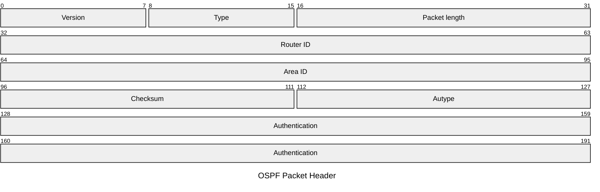

# OSPF
## 1. OSPF Packet

字段解释：

OSPF 报文采用三层封装结构，自上而下分为：
- **IP Packet Header**：OSPF 协议报文由 IP 协议承载，协议字段标识为 89，用于指示上层为 OSPF 协议。
- **OSPF Packet Header**：固定 24 字节长度
- OSPF Packet Data：根据报文类型承载不同路由信息。

注：IP 协议号是 89，如果 ACL 把 89 协议号或者 224.0.0.5 拒绝，OSPF 将无法正常工作。

默认情况：
- OSPF 报文源 IP 地址为接口主 IP 地址
- OSPF 报文目的 IP 地址为 224.0.0.5 时，代表所有运行 OSPF 协议的设备
- OSPF 报文目的 IP 地址为 224.0.0.6 时，代表链路上的 DR/BDR

## 1.2. 报文类型与功能
OSPF 定义五种标准报文类型，共享相同报文头结构：
Type 1 Hello
Type 2 Database Description
Type 3 Link State Request
Type 4 Link State Update
Type 5 Link State Ack

### 1.2.1. Hello
Hello 报文在广播型和 P2P 链路，默认 10 s 周期性发送；在 NBMA 和 P2MP 链路，默认 30 s 周期性发送。默认邻居失效时间是 Hello 周期的 4 倍。Hello Time 和 Dead Time 可以自定义。

### 1.2.2. Database Description

### 1.2.3 Link State Request

### 1.2.4 Link State Update

### 1.2.5 Link State Ack
